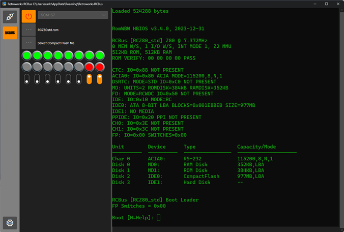

# Retroworks

## Introduction
Retroworks is an application for working with retro computers, written in .Net, C# and Avalonia. It connects to the retro computer using a serial port, but can also connect to the internal software emulator. It builds and runs on Windos, Mac and Linux.

It is still work in progress and has some support for [RCBus](https://smallcomputercentral.com/rcbus/) type of computers.

 
